# The Designer

## Preliminary settings

### Starting the program

Start Confire Blackboard Designer via the Windows start menu by going to `Start > STÜBER SYSTEMS > Confire Blackboard Designer`. If you are working with Confire Blackboard for the first time, we recommend you open one of the example files provided by clicking the circular Blackboard button at top left: `Blackboard Button > Open`. These example files contain the same layouts and differ only in that they have been created for different public display resolutions.

* File `Example 1920x1080.blackboard`
* File `Example 1366x768.blackboard`
* File `Example 1360x768.blackboard`
* File `Example 1280x800.blackboard`

For the remainder of this chapter, we will refer to the example file `Example 1920x1080.blackboard`, which was created for a resolution of 1920x1080 pixels.

In Designer, you create layouts for a destination screen on which the layout is to be displayed later. To start with, the layout is like a blank screen which you fill up with content by adding pictures, text, animations and videos. You can specify when the layout is to be displayed on the destination screen using the schedule.

### Specifying the resolution for your public display

Before you can start creating new layouts, you need to set the screen resolution for the public display you want to play back/display content on later on. Start the relevant dialogue via `Blackboard Button > Properties`.

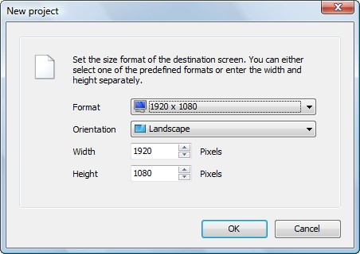

When creating projects, these need to be set for a specific resolution. If you want to display the content on two different monitors using different resolutions, you will therefore need to create two separate projects. It is best to create the presentation for the screen with the highest resolution then to copy the project files, set the lower resolution and then revise the layouts accordingly. 

If you are using public displays with different screen resolutions, you will need to adapt the content to each screen resolution accordingly i.e. use a separate project file for each resolution.

## The Confire Blackboard Designer window

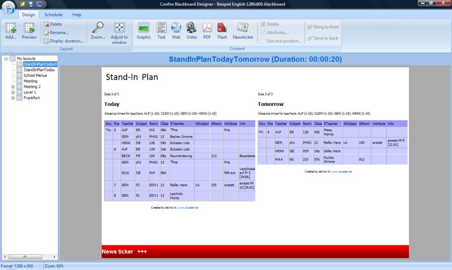

The Confire Blackboard Designer window consists of three different views, each of which brings together the various activities involved when creating presentations. You can switch between these three views using the "Design", "Schedule" and "Help" tabs at the very top of the window above the menu bar. You use the "Design" area to design your presentations. In the "Schedule" area you can also specify which parts of your project are to be shown on which day or at which time if you wish. The "Help" section provides information about the program itself.

## Creating presentations

When creating presentations, you begin with layouts - presentation screens that are initially empty and to which you then add content. You do this in the main window in Confire Blackboard Designer in the "Design" view. The individual layouts that make up the project are displayed here and you can edit them. The screenshot above shows the layout for a school's stand-in (cover) timetable called "SPlanTodayTomorrow". Above the main window you will see the menu bar with the "Layout" and "Contents" areas. The "Layout" area is for creating, deleting and arranging layouts while the "Contents" area is for adding and arranging contents within the edited layout. On the left next to the main window is the project tree. The root layout is entitled "My Layouts“ and the list of all layouts and sublayouts for the project branches off from this.

### Adding a layout

To add a layout to your project, click the layout you wish to add a new sub-layout to on the left. Now click on the "Add" button. For instance, to add another layout named "Berlin" in the example project, click "My Layouts" and then click "Add". You can change the order of the layouts by right-clicking and then clicking "Up" or "Down" In addition, you can drag sequences and drop them into subsequences.

### Adding contents to the layout

As mentioned earlier, you fill a layout with content by adding pictures, text, animations or videos. To do this, click the appropriate button in the "Content" toolbar.

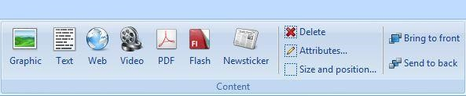

* "Graphic" for picture files (.JPG, .PNG, .BMP formats are supported)
* "Text" for text files (.RTF, .TXT formats are supported)
* "Web" for files from the Internet or in corresponding formats (e.g. .HTML)
* "Video" for video files (.AVI, .WMV formats are supported)
* "PDF" for Acrobat Reader documents (file extension .PDF)
* "Flash" for Flash animations (file extension .SWF)
* "News ticker" for RSS feeds from the Internet or Text files (file extension .TXT)

When adding content files, you can decide for each file whether to embed files in the existing project or just use it as an external source. The difference between these two options is explained in the sections Embedding content files and Integrating content files as an external source" that follow.

## Arranging layouts in sequences

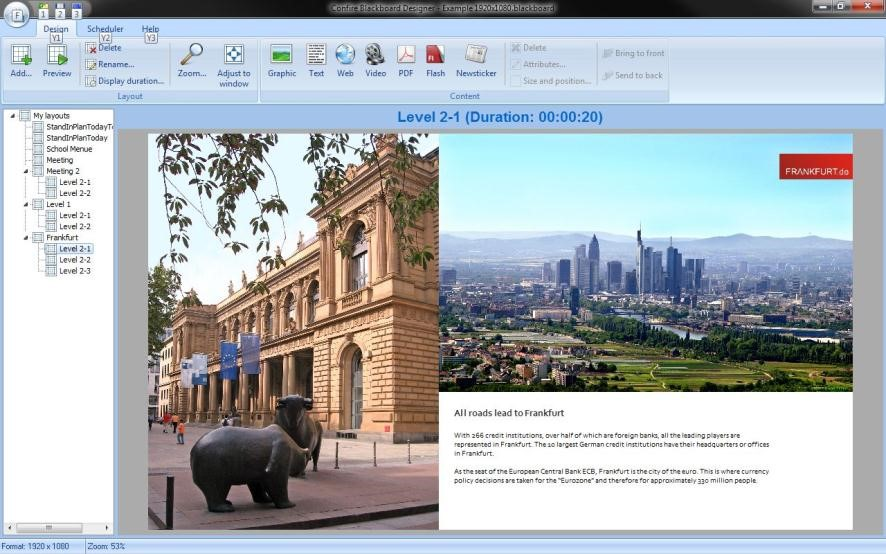

Several layouts arranged beneath one another in the project tree form what is known as a sequence. With a sequence, you enter a display duration for each layout. This appears in the main window next to the name of the layout currently displayed. You can change the previously set display duration for each individual layout using the "Display duration" menu item from the "Layout“ toolbar or simply double-click on "Display duration“ in the caption of the main window to access this menu. If you start a sequence like this by selecting any starting point and clicking the "Preview" button, all individual layouts will appear in sequence according to the relevant display duration, like with playlists on MP3 players.

There are some special features of this hierarchical arrangement of lists in the form of a project tree. Initially, each layout in a sequence may in turn comprise a sequence of sublayouts and so on. In the example project shown you will see that the layout "Frankfurt" comprises a sequence of sublayouts "Level 2-1", "Level 2-2" and "Level 2-3". Using the "Preview" function will, just as later with Confire Blackboard Player, play back all layouts in sequence located under the initial layout selected when you click the playback button. If you select the root layout "My Layouts“ as the starting point for instance, all layouts in your project will be played back since all are located under the root layout. If you select the layout Frankfurt as the starting layout for playback, only the three sublayouts it contains "Level 2-1“, "Level 2-2“ and "Level 2-3“ will be played back in turn until you interrupt the display.

## Arranging contents in various levels

The layout "Frankfurt“ in the example project selected also demonstrates the second special feature when arranging content in hierarchical layout lists in the project tree: Elements such as images or texts that you have added in the higher level "Frankfurt" will also be shown on all three lower levels (i.e. "Level 2-1“, "Level 2-2“ and "Level 2-3“. This is helpful because you only need to add contents you want to display frequently once. Working with levels therefore saves time when you want to display layouts in sequence which only differ in a few details.

The "Level 1" sequence in the example project is an example of use of levels. This consists of the frame layout Level 1 and the two detailed layouts Level 2-1 and Level 2-2. The content of the frame layout with the screen at bottom left and the Confire Blackboard program icon top right appear as the back-ground level in all detailed layouts.

The frame layout Level 1 forms the background level for the two detailed levels i.e. the detailed layouts Level 2-1 and Level 2-2.

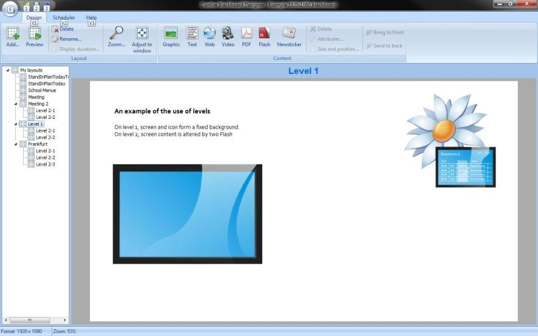

The Flash animation with the bugs is located at detailed level 2-1.

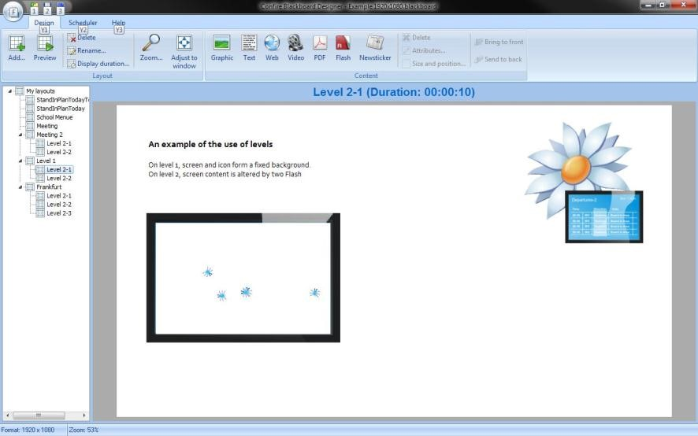

The Flash animation with the dashes is located at detailed level 2-2.

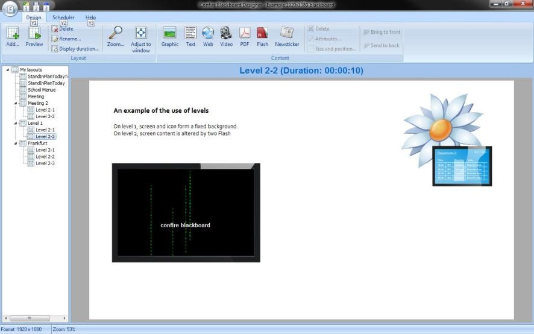

The sequence named "Frankfurt" in the sample project is another example of use of levels. In this case, the picture of the skyscraper with the FRANKFURT.de logo is located at frame level. The detailed pictures on the left and the descriptive text on the right at the bottom are located at detailed levels 2-1, 2-2 and 2-3.

## Embedding content files

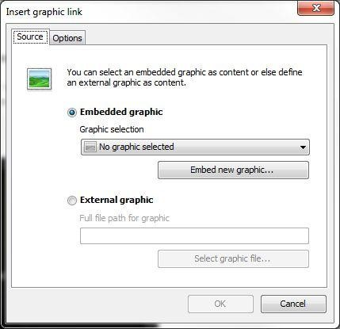

If you embed content files, a project folder will be created in addition to your project file into which all embedded content files are copied. Once you embed a content file (e.g. an image or a HTML document in your project, Confire Blackboard Designer and Player will no longer access the original file on your hard drive (e.g. in the "My Pictures" folder) but instead access the copy in the project folder. All embedded content files are therefore merged for clarity in a single directory and there is no danger of accidentally moving or deleting files you use in your Confire Blackboard projects.

Secondly, this enables you to transfer Confire Blackboard projects to other computers easily without having to bother about the original paths for the files you have embedded. You merely have to copy the Blackboard file and the project folder with the content files to the other computer. Conversely, providing you have embedded the files, you can copy or forward a project by copying the project file with the file extension "blackboard" along with the project folder with the extension "contents". Note Apart from the extension, project file and project folder will always have the same name. The project folder "Example.blackboard.contents" therefore belongs to the project file "Example.blackboard" and both must be stored in the same directory if moved.

To embed content files in a project, proceed as follows:

1. Unless you have already done so, save your Blackboard project under your chosen name in the appropriate location.

2. Click on a button for integrating content files e.g. the "Graphic" button

3. Go to "Embedded Graphic" on the "Source" tab of the window which appears.

4. Select a graphic from the Graphic Selection list. This will contain a list of graphics you have used previously. Alternatively you can select a new graphic from your hard drive by clicking "Embed new graphic".

5. In the window that appears, enter the file path for the graphic or open a file browser using the "Select graphic file..." button and select a graphic file.

6. Click "OK" to confirm your selection and then click OK again to finish.

The embedded graphic will now be shown in Designer. The function for embedding content files will only become available once you have specified the file name and storage location for the Blackboard file. 

> #### info::Note
> 
> "Embedding“ means merging together all files used in your project e.g. images, HTML, videos etc. in one folder.

## Integrating content files as external sources

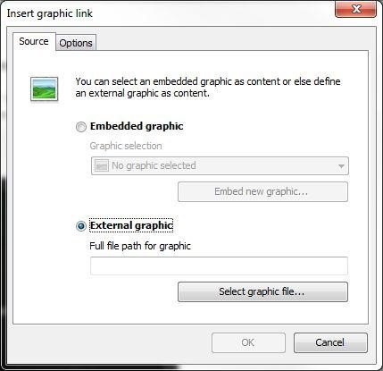

If you do not wish to embed a content file but prefer to integrate it as an external source, Confire Blackboard Designer and Player will load these directly from the directory specified on integration and no copy will be created in the project folder. Files may therefore only be integrated as external sources providing both the PC with Confire Blackboard Designer and the PC with Confire Blackboard Player have access to them. When specifying the path for the integrated file in Confire Blackboard Designer therefore, make sure the Player can access the file later using the path you specify. This generally applies only for files stored on a server or in an approved folder on the local network such as "www.tagesschau.de/nachrichtenticker“, "www.meinunternehmen.com/bilder/unser_logo.jpg“ or "\\schulverwaltung\vertretungspläne\davinci\V_TK_001_1.html“.

This prerequisite makes working with embedded files simpler for some tasks than working with embedded external files. As embedded files are located in the project folder, these are copied automatically too each time a project is forwarded or transferred to public screens using the "Publish" function. Use of external files also has its advantages however. One important benefit is that, with external files, it is simpler to dynamically integrate content from external sources not specially created for display using Confire Blackboard into public displays. Providing your public displays have internet access, you can display the latest weather information or news from the internet at all times by incorporating an external RSS news feed or a Flash weather applet for example. External content need not necessarily stem from external sources however. Likewise, you can display public news from your own organisation's website on your public displays by integrating this as an external source without having to copy it anew every day. The same applies for a daily menu created using an Office program in a restaurant for example or for the latest internal stand-in teaching plans at an educational institution, providing these can be accessed in the local network.

Embedding of content of this nature in a layout is of course quick and simple. But integrating it as an external resource has the advantage that individual content elements displayed can be changed without you needing to update the relevant layout. A chef therefore merely needs to update the menu in the RTF table or the timetabler in a school update the cover plan. Integrated content will be called up anew for display each time from the storage location specified, unlike embedded content. If you have changed anything there, this change will appear immediately on your display screens the next time the layout is run.

It is up to you to decide for yourself which option to use. Generally speaking, the greater effort required integrating information sources as external sources pays off quickly because updated information does not require changes to the presentation and updates can be made several times a day by various persons.

To integrate content files as external sources, proceed as follows:

1. Click one of the buttons for integrating content files e.g. the "Video" button.

2. Go to "External video" on the "Source" tab in window which appears.

3. Next click "Select video file" and choose the video file you want in the file explorer window which appears.

4. Click "OK" to finish.

The integrated video file will now be shown in Designer.

### Integrating or embedding HTML documents comprising several pages from daVinci

You can also add HTML documents comprising several pages from daVinci to a layout. daVinci is a complete solution for timetable planning and substitute timetable planning from STÜBER SYSTEMS. When content is displayed, Confire Blackboard Player automatically detects that further pages are linked to a certain HTML page and pages forward.

Multiple-page HTML documents can be shown in the Player without any additional effort providing all interlinked files are located in the same folder and this is used to integrate them into the Blackboard file. If they are, only the first page of a multiple-page HTML document needs to be integrated into the project.

Should you want to copy content files of a project into a separate subfolder using the embed function, it is not enough to embed the first page into the project however. You will also need to specify the parent folder in which the other HTML pages are located for transfer to the project archive.

To ensure that a multiple-page HTML document is copied into the content files' folder correctly, proceed as follows.

1. In the destination layout, click the Web button in the Content toolbar.

2. In the window which appears, select "Embedded HTML page" and click "Embed new HTML page"

3. In the window which appears, enter the file path for the first page of the HTML document.

4. Select the checkbox next to "Embed entire parent folder"

5. Click "OK" to confirm your entries.

All HTML files stored in the folder specified are now copied into the content files folder for the Blackboard project you are editing.

Should your project contain various multiple-page HTML documents whose linked files are all located in the same folder, you need only enter the folder for the linked files once.

## Positioning contents

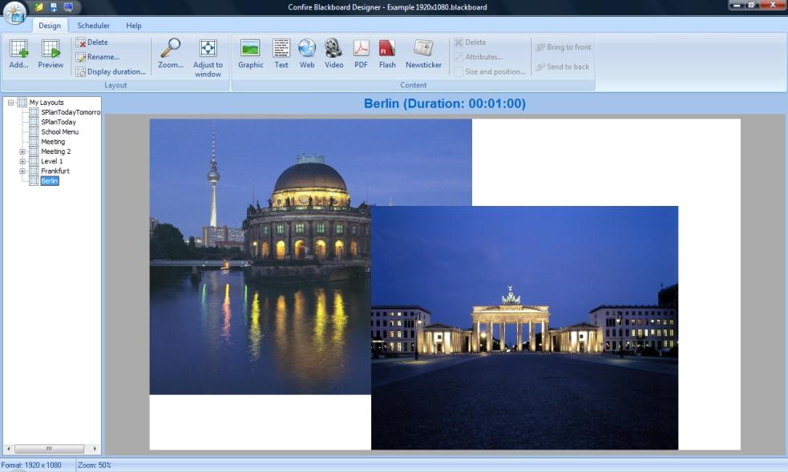

### Moving contents and adjusting their size

In Confire Blackboard Designer, you can position and move your content within the work area or layout as required. If you wish to, you can also place contents on top of one another. Either you enter a specific location or a specific size for the content you have added using the "Size and position" dialogue or you simply use the mouse to move and zoom it.

1. Click on the object you want to move or whose size you want to change. As soon as you have selected an object in this way, a positioning frame will appear like with Microsoft Office so that you can alter the selected objected.

2. To move an object, click on it and move the mouse pointer while holding down the left mouse button.

3. Move the mouse pointer over one of the small white squares on the positioning frame so that a double arrow appears. If you now hold down the left mouse button and move the mouse pointer, you can change the size of the object as desired.

To set a picture to an exact width or height, simply click the on picture and then the "Size and position" button on the Content toolbar and enter a corresponding numerical value.

Removing the checkmark next to "Lock aspect ratio“ will enable you can to blur content too in relation to the original width-to-height ratio. Conversely, you can restore the original size or the original width-to-height ratio for a graphic or a video for instance using the "Size and Position" dialogue by using the "Set original size" buttons and "Set original width-to-height ratio".

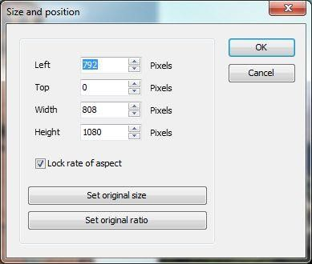

When working with pictures, videos or flash animations, note that these were created for a certain width-to-height ratio and for a certain width and height. With HTML documents, this is generally not the case as they are de-signed to be shown on all screens with their various resolutions. PDF documents too have no precise width-to-height ratio or original size. If you change the width-to-height ratio, the pictures and videos will become blurred. Blurring will not occur with Flash animations. The edges will however be larger or the picture will be cut off. For this reason, you should generally retain the width-to-height ratio.

### Aligning objects

Right-click or click `Design > Content` then select `Bring to the front` or `Send to the back` to bring an image to the front or place it at the rear.

When aligning content horizontally and vertically, the alignment grid in Confire Blackboard Designer will help you. The alignment grid in Designer can be used by activating the function `Align to grid` by clicking `Blackboard-Button > Properties > Designer`. In the input fields of the horizontal or vertical grid, specify the grid stages as pixels. If you place a checkmark next to the `Align to grid` function, all contents will be positioned and aligned in accordance with your specifications. To see the grid, insert a checkmark next to `Display grid`.

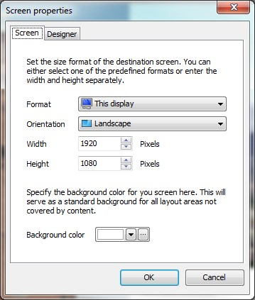

The grid is made visible by the pixels on the white layout background, which makes precise alignment and scaling easier. 

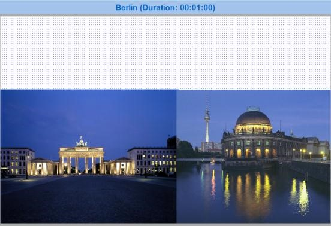

> #### info::Note
> 
> Depending on the number of pixels set, the grid will only be visible providing the window for the Confire Blackboard Designer application is large enough.

## Integrating a news ticker

You can use the news ticker to display the latest information.

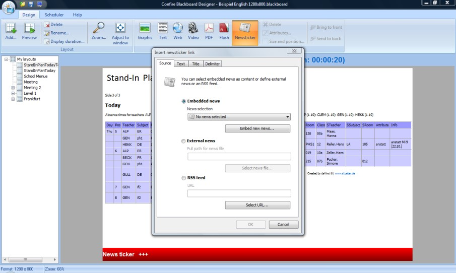

This can be displayed on a screen presentation like with rolling news channels on TV. The main benefit is that you can also call up the news file via an internet connection, thereby enabling you to display the latest information in several school buildings simultaneously. Alternatively, you can import an RSS feed - the news pages of the BBC for instance.

In the sample project, the layout "SPlanTodayTomorrow" uses a news ticker from a local news file.

## A note on fonts

The fonts you use in Confire Blackboard Designer should also be available on the computer for the public display screen. If they are not, similar fonts will merely be used on the public display, which may lead to different line breaks. Which fonts are installed as standard depends on the operating system installed. The Vista fonts Corbel, Candara, Colibri and Cambria are not installed as standard on Windows XP computers for instance. To be safe, you should therefore either use only Arial, Arial Black and Times New Roman on older Windows versions or else ensure the fonts you use are also installed on the public display computer.

## How to create superior layouts

To create first-class layouts, you need to observe the following rules:

1. Always create your layouts for the screen size of the destination screen. You will need to a adapt the layout for a destination screen with a different screen resolution.

2. Always stick to the original width-to-height ratio for pictures and videos.

3. You can make pictures and videos smaller but should avoid enlarging them beyond their original size if possible.

4. Never use more than two fonts for each presentation.
5. 
5. Remember the fonts you use in the Designer should also be available on the PC for the public display.

## Working with the schedule

A schedule enables display of layouts using a timer.

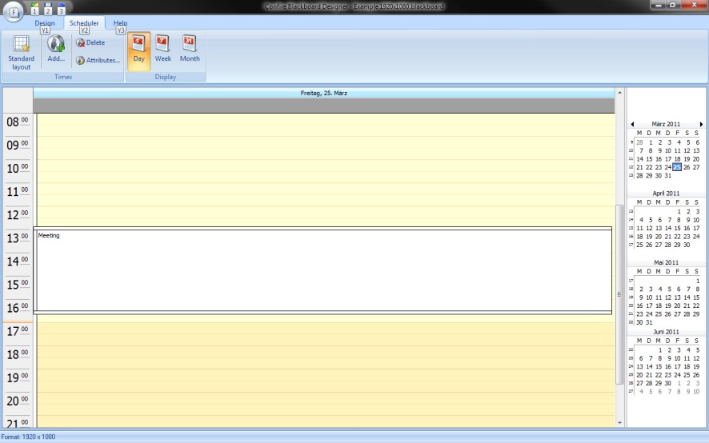

You can use the time schedule to display certain layouts on a particular day, at a particular time or according to a certain cycle e.g. every Wednesday at 5:30 pm. To do this, click the tab page for the "Schedule" view in Confire Blackboard Designer. You can enter times at which certain layouts are to be shown there like with Microsoft Outlook. The "Schedule" view window comprises a main window in which you see the calendar pages for the display times entered in an adjustable calendar view. To the right of this is a smaller calendar overview in which you can select the time frames to be shown in the main window. At the top edge of the program window is the menu bar with the "Times" and "Display" toolbars. Using the buttons in the "Times" toolbar, you can create, delete and edit times. The "Display" toolbar contains the settings for displaying the calendar view.

### Specifying a standard layout

When working with the schedule, you should define a standard layout that is always shown if no other display time has been entered. This prevents a blank screen being displayed by mistake and also means you do not need to specify separately times for the layout that appears regularly but instead just enter the exceptions in the schedule.

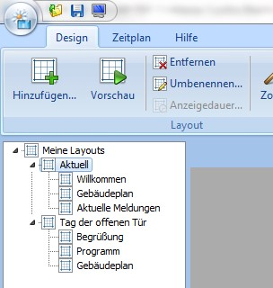

To specify a standard layout, proceed as follows:

1. In the "Schedule" menu, click the "Standard layout" button.

2. Click on the small magnifying glass to the right of the "Layout" display.

3. In the "Select layout" window which opens, select the desired layout in your project tree and click "OK" to confirm.

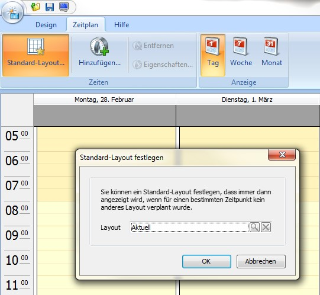

### Adding a display time

Click "Add" in the schedule menu to add a new display time. Now enter the desired start time and finish time and specify which layout you want to show. Alternatively you can also select a time frame in the central calendar view by holding down the left-hand mouse button, right-clicking and adding a time for the chosen period. You can also enter a comment, which then appears in the calendar view too. Now click "OK" to confirm.

> If you select a period in the small calendar overview on the right next to the central calendar view using the mouse, the time details shown in the central, overall view will change likewise.

## Entering a series of times

If you click the "Time series" button in the "Properties" or "New display time" dialogue for a display time, you can also specify the start and finish time for the period, as well as how and up to which date or how often the time should be repeated. For example, you could specify: "Lunch menu“ layout from 12 pm to 3 pm, repeated each day, every weekday until the end of May.

After specifying this for your series of times and then confirming with "OK", a separate calendar page will be shown in the calendar view for each display time in the series. Two circular arrows appear at the top left of the page to indicate that this is a series rather than a number of individual times. It is recommended you also provide a meaningful entry in the "Comments" field for your time series.

### Changing the display time for a single time or a series of times.

Like with Microsoft Outlook, you can also change the display time for a single time retrospectively by dragging and dropping it with the mouse. As well as moving the time to another place, you can also extend it or shorten it by dragging the edges of the relevant calendar page. This can also be done for several days. If a time covers several days, the calendar page display changes to a single a bar spreading across several days at the upper edge. The exact start and finish time is displayed in a clock icon in each case.

Alternatively you can change the display time using the "Display time properties" dialogue by selecting a time and clicking the "Properties“ button in the upper menu bar or right-clicking a calendar page and selecting "Properties“ in the context menu.

If you change the time display by dragging and dropping it and this is part of a time series, the time will remain an element of the original time series. The two circular arrows indicating it is part of a time series will now appear crossed out however so that you can see the time no longer corresponds to the display time for the original series. Only the individual display time will change - the other times in this series will not be affected by this change.

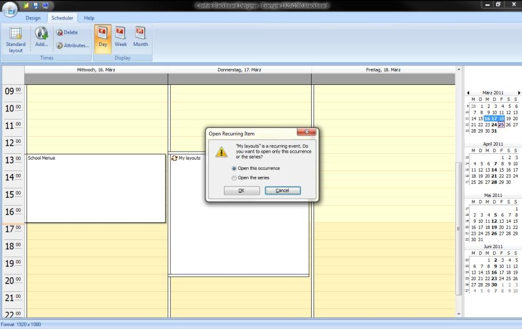

### Removing a time or a series of times

Selecting a time and then clicking the "Remove“ button in the top menu bar or in the context menu for the calendar page will remove the time from your display calendar. Should the selected time be part of a series, you will be asked prior to deleting it whether you merely want to delete the individual time or the entire series.