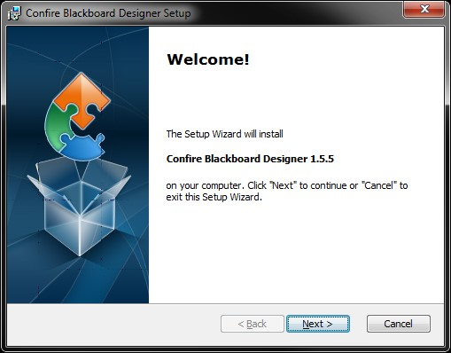
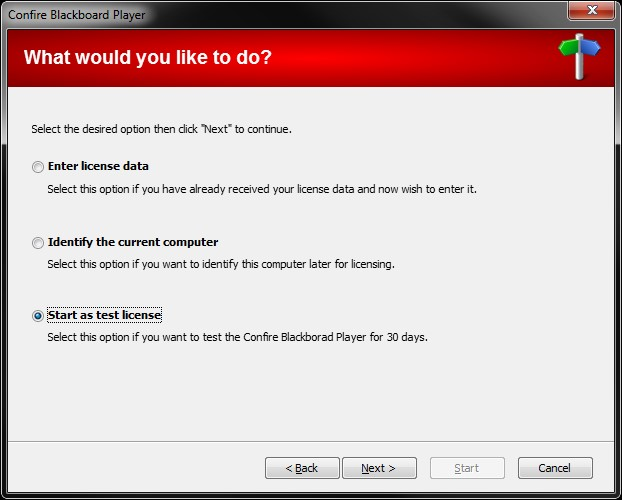
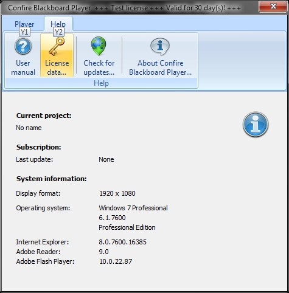
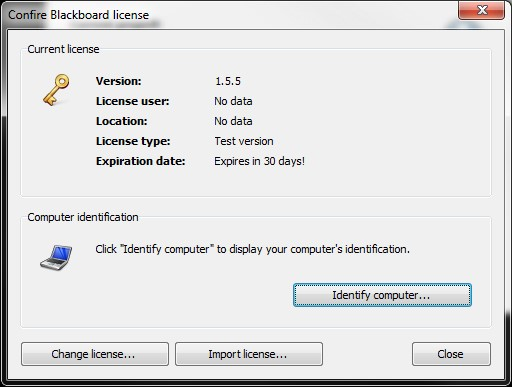
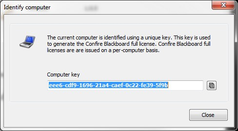
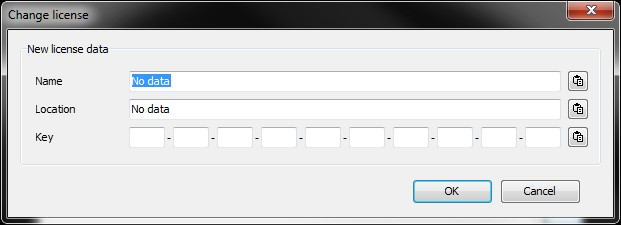

# Installation

## Downloading the setup packages

Confire Blackboard software consists of two modules, Confire Blackboard Designer for creating presentations and Confire Blackboard Player for displaying these presentations to a public audience. 

Separate setup files are provided for installation of both of these modules: 

* `ConfireBlackboardDesignerSetup.exe`
* `ConfireBlackboardPlayerSetup.exe` 

Both of which can be downloaded using the [link to our website]. 

## Before installing

Typically, Confire Blackboard Player is installed on the computer designated for displaying presentations. Generally-speaking, this is the computer installed at the rear of the display. Designer is usually installed on the computer on which the presentations are created before being forwarded for display purposes. Both modules can also be installed on the same computer without any problems for test purposes for instance.

## Differences between the licensed version and the test version

You can install Confire Blackboard Designer without any restrictions and use it to its full scope on as many computers as you wish. No license is required for this. Confire Blackboard Player on the other hand is installed as standard on a 30-day test license basis. This enables you to test Confire Blackboard software for 30 days, during which time you can make use of its full scope and take advantage of free support without having to request license data. In order to use Confire Blackboard Player permanently
and without any restrictions, you will need to purchase a license from STÜBER SYSTEMS. The full license includes a three-year subscription during which you will be entitled to free support and all updates and service updates that appear in this time. Once this license has expired, you can continue to use the software and may purchase an extension to your subscription if you wish.

## Starting setup

Start the setup by double-clicking on the relevant setup file. The setup assistant will now guide you through the setup process. During setup, you may specify a directory into which program files are to be copied yourself or else simply accept the directory suggested by the setup assistant and click `Install`. You may also need to enter your Windows administrator password or click `OK` as part of Windows User Account Control. Now click `Finish` to complete the installation process.

## Starting Confire Blackboard software

After completing setup, you can start Confire Blackboard Designer and Confire Blackboard Player by clicking on the relevant link in the Windows Start Menu (`Start > STÜBER SYSTEMS`). The link for access to the Confire Blackboard user manual containing all the information you will require to use the software can also be found there. The first time you start Confire Blackboard Player, a welcome page will appear asking you to choose between a 30-day test license or permanent use with a full license.

## Testing Confire Blackboard Player with a test license

If you have not yet purchased a full license, you can test out Confire Blackboard Player using a 30-day test license. To do this, click `Next` on the welcome page that appears the first time you start the Player and then select `Start as test license`. After clicking `Start`, you will see the test license start page, which will tell you how much of the test period is remaining. Clicking again on `Next` will start the Player with the chosen test license. After the 30-day test period has expired, on starting Confire Blackboard Player you will be taken back to the welcome page again where you can purchase the software permanently by entering your full license data.

## Requesting your license

Licenses for permanent use of Confire Blackboard Player are created on an individual computer basis i.e. the licenses entitle you to use the software in combination with a certain computer. To enable us to assign the license to a certain computer, Confire Blackboard Player determines a unique "computer key“, which you will need to inform us of when you request a license by sending an e-mail to `license@stueber.de`.

To generate the computer key for identifying the computer on which Confire Blackboard Player is to be installed permanently, select `Identify this computer` on the welcome assistant when first starting the Player. Once the test license has expired, you will automatically be directed to this screen.

You also have the opportunity while using the Player with a test license to generate a computer key at any time by clicking `Licensing...` on the `Help` tab and then clicking `Identify computer` in the window that opens.

Klicken Sie anschließend auf `Computer identifizieren`.

In both cases, a window will open up that displays the computer key as a string of characters. You can copy this to the clipboard with `Right click > Copy` or else use the `Copy key to clipboard` button on the right next to the key shown. Now insert the key into our e-mail and send it to `license@stueber.de` to request a license.

## Entering your license data manually

Shortly after you have sent us your license request, you will receive a reply from us containing your license data. You can then either input the information manually or import it as a file.

If you do not yet have a license for Confire Blackboard Player or if your test license has expired, select `Input my license data` in the welcome assistant to enter your license data. A window will open up in which you can enter your license data directly or else insert it from the clipboard. Alternatively, you can use the `Import license` option as described in the following section.

If you are currently using Confire Blackboard Player with a test license, please proceed as follows to enter your license data manually:

1. Start Confire Blackboard Player.

2. Go to the `Help` tab and click the `Licensing...` button.

3. Click the `Change license` button and insert the name and location of the license-holder as well as the license key from our e-mail into the fields provided in the `Change license` window.

4. Click `OK` to confirm your entries.

The license data you have entered will now appear in the `Confire Blackboard License` window. Close this window to use the version of the Player you have just generated a license for.

## Importing a license file

You will find the file `Blackboard.Player.lic` as an attachment to our licensing e-mail. Instead of entering the license data manually, you can also import it from this file to save you the effort of typing in the information. To do this, proceed as follows:

1. Save the lic file located in the attachment of our licensing e-mail in a destination directory.

2. Start Confire Blackboard Player.

3. Go to the `Help` tab and click the `Licensing` button.

4. Click `Import license` and enter the destination directory for your license file in the Explorer window that appears.

5. Select the `Blackboard.Player.lic` file and confirm your selection with `Open`.

After closing the `Confire Blackboard License` window, you can start using the version you have just licensed.

[link to our website]: http://showtime.stueber.co.uk/download-archive.php