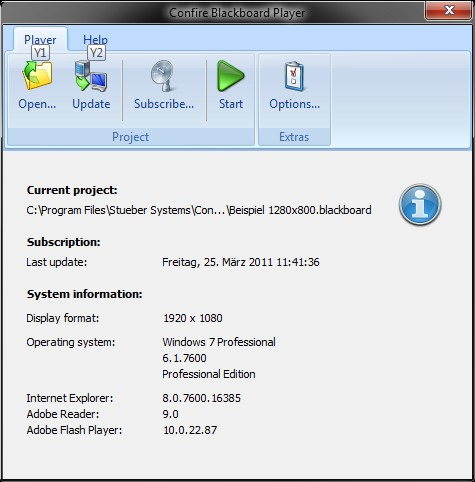
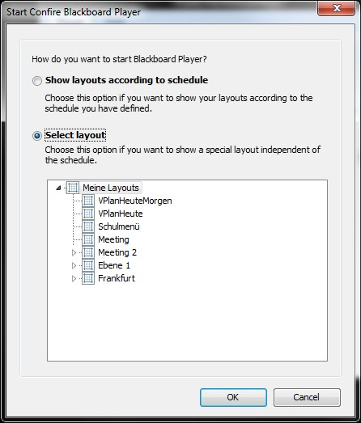

# The Player

## Starting the program

Confire Blackboard Player is installed on the computer for the destination screen (public display or digital notice board). It shows presentations created with Confire Blackboard Designer. You can start the Player via the Windows start menu. To do this, click `Star > STÜBER SYSTEMS > Confire Blackboard Player`.

The Player displays layouts created with Confire Blackboard Designer on the public display.

## The Confire Blackboard Player window

The Confire Blackboard Player window comprises a menu bar, the upper area of which provides access to the operating functions and the lower window area of which shows the system information. The system information area shows you which project is currently loaded and when Confire Blackboard Player last recalled a project that has been subscribed to. In addition, it shows the display's screen format and which operating system the computer is working with. You can also view the Internet Explorer version details (you need this to display web contents) and for Adobe Flash Player (which you need to play back flash animations).

## Opening and starting a presentation manually

Click "Open" to open a presentation. Now specify a presentation or a layout sequence with which to start the presentation by clicking the "Start" button.

You can also choose whether you want to show the presentation according to the schedule ("Layouts by schedule") or as a sequence ("Select layout").

If you choose the option "Display layout according to schedule“, the Player will then show the precise contents for which you previously specified display times using the "Schedule" function in Designer. For details on how to use the schedule, see the section "Working with the schedule".

If you choose the option "Select layout", all layouts in the project tree under the layout or sublayout you have selected in the dialogue will be played back as a sequence according to the display length you entered in Designer. For details of how to organise successive presentation screens into sequences, see the section "Arranging layouts into sequences“.

## Opening and starting a presentation using autostart

You can also set the Player to open automatically with a certain project file on starting your computer. To make this setting, proceed as follows:

1. Create a link to the application file "ConfireBlackboard.exe"

2. Right-click on the link and select "Properties" from the context menu.

3. In the dialogue box which appears, choose the "Link" tab.

4. Under "Destination" add one of the two parameters below to the program path e.g. "C:\Program Files\Stueber Software\Confire Blackboard\ConfireBlackboardPlayer.exe".

   * Add [space]-autoplay if you want your project file to be shown with the "Select layout" option from the first layout.

   * Add [space]-autoplay[space]/s if you want your project file to be started with the "Show layouts by schedule" option.

5. Click "Accept" and then "OK" to confirm your data.

6. Create a copy of the link and store this in the Autostart folder of your Windows computer.

The next time you start the computer, Confire Blackboard Player will automatically be started with the Blackboard file you stored in the Player start options.