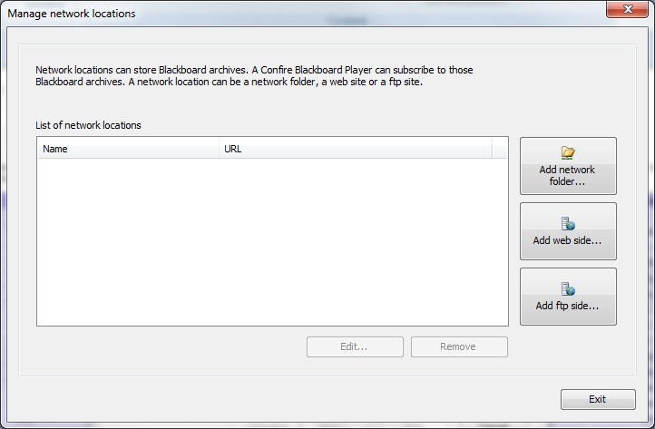
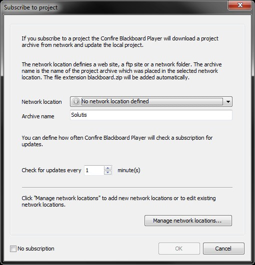

# Publishing and subscribing to projects 

## Interaction between Designer and Player

Normally a Blackboard presentation is created on one computer and played back on another computer. If you are currently using Confire Blackboard Designer and Player on the same computer with a test license, this procedure may not be of importance to you yet. When using Confire Blackboard on a day-to-day basis however, the matter arises of how to transfer a presentation, which may have been created on a laptop, to the destination computer that controls how this appears on the public display as quickly and simply as possible.

In the section "Adding contents to the layout", you learned how to embed content files into the project. Projects with embedded content files can be transferred to another computer by copying the Blackboard file and the relevant project folder to the destination computer. You can of course just as easily save the two components in a network directory that can be accessed both by the computer used to edit the presentation and the computer that controls the on-screen presentation. This manual copying procedure may be a good idea with local networks but in situations where projects need to be transferred from another location with no access to the local network or as a service, this cannot be done however. To simplify this transfer process, Confire Blackboard Designer has the "Publish" function. This works by specifying a storage location in a network folder, FTP or web server in which a project archive is stored with information for updating the presentations it contains.

Confire Blackboard Designer can then "subscribe" to these project archives as a sort of counterpart to the "Publish" function in Confire Blackboard Designer. This means the Player calls up information on updates to the project archive on a regular basis once it has subscribed to a project archive. If the presentations or schedules have been updated by Designer, Confire Blackboard Player loads the project archive again so the updated contents can be displayed. Just as a network location - e.g. a network folder - can be used by several Players (or Designers) at once, a published project archive can also be subscribed to by several Players simultaneously. In day-to-day practice, Player subscribes to a project archive from a network location and Designer is used to edit and update the presentations, contents and schedules it contains as required. For publishing and subscriptions to take place, a network location must first be specified however. Details of how to add a network location and manage it can be found in the next section. 

Network locations or published projects are often named after the place of use and display tasks: "Main building“, "Entrance area“, "Men's department“ or "Latest“, "Special offer“ etc.. This can make orientation easier in case of several displays or digital notice boards. Two separate projects are only necessary in principle however if two different screen resolutions are to be used or two displays need to display different presentations simultaneously. Creating the areas such as "Main building“, "Entrance area“ or "Special offer“ within an individual project in the project tree as a logical subdivision and using the information in the sections "Arranging contents into different levels“ and "Arranging layouts into sequences“ may make your work easier however.

## Managing network locations

Calling up the "Publish" function in Confire Blackboard Designer via the Confire Blackboard main button at top left (Blackboard button|Publish) will cause the "Publish project" dialogue to appear. This will guide you through all the steps required to create a project archive. First you will be requested to specify a network location to which the compressed project archive can be saved. Needless to say, this location must be accessible both by the computer on which Designer is used and the PC on which Player is running. This might be a network folder for which appropriate access rights have previously been specified in the local PC network or a password-protected folder on an FTP server or a WebDAV release on a web server.

If you are using the "Publish" function for the first time, no network location will have been entered for publishing so you will first have to click the "Manage network locations" button to enter a least one network location.

The same dialogue will also start if you click "Subscribe" in Confire Blackboard Player and then "Manage network locations" because the desired network location has not yet been entered in the list of network locations available for subscription for instance.

### Adding a network folder

To add a network folder as a storage location for published project archives, proceed as follows:

1. Click the "Add network folder" button and enter the name to be shown for your network folder later in the program in the Name field in the dialogue that starts e.g. "Confire Blackboard network folder“.

2. Now, in the "Path“ field, enter the path for the network folder previously released for Player and Designer or click the "Browse“ button to make your selection using the mouse.

3. You can optionally click the "Test network folders“ button to test whether the network folders you have entered are really accessible from the computer on which you are working.

4. Click "OK" to confirm this.

You will now see the newly entered network folder in the list of network locations. You can edit this using the "Edit“ and "Remove“ buttons or remove it again.

### Adding a website

To add a WebDAV release to the network locations for publishing your project archives, proceed as follows:

1. Click the "Add website" button and enter the name to be shown for you network folder later in the program in the Name field in the dialogue that starts e.g. "Confire Blackboard web release“.

2. Now enter the internet address for your WebDAV release in the "URL“ field. You also need to enter the login data specified when setting up your web release in the "User name“ and "Password“ fields.

3. You can optionally click the "Test website“ button to test whether the web release you have entered is really accessible from the computer on which you are working.

4. Click "OK" to confirm this.
 
You will now see the newly entered web release in the list of network locations. You can edit this using the "Edit“ and "Remove“ buttons or remove it again.

### Adding an FTP server

To add a folder on an FTP server to the network locations for publishing your project archives, proceed as follows:

1. Click the "Add FTP site" button and enter the name to be shown for you network folder later in the program in the Name field in the dialogue that starts e.g. "Confire Blackboard FTP site“.

2. Now enter the internet address for your FTP server in the "URL“ field and the folder provided. You can also enter the login data specified when setting up your FTP server in the "User name“ and "Password“ fields.

3. You can optionally click the "Test FTP site" button to test whether the FTP site you have entered can be accessed without any problems.

4. Click "OK" to confirm this.

You will now see the newly entered FTP site in the list of network locations. You can edit this or remove it again using the "Edit“ and "Remove“ buttons.

## Selecting a network location for publishing and entering an archive name

Providing you have created network locations for publishing your projects as explained in the preceding section, you can select a network location for "Publishing“ your current project in Designer from the "Network locations“ list. Call up the "Publish" function by clicking Blackboard button|Publish. Using the "Manage network locations" button, you can start the dialogue for creating, deleting and testing your network locations described in the previous section. Once you have selected a network location from the list to which your project is to be published, click "Next". You will then be requested to enter a name for your project archive. You can choose any name when creating a project archive for the first time - it need not correspond to the name you have used to save your project locally. 

The name for the project archive should be distinctive and easy-to-remember. If you are publishing a project for the first time, you will need to enter the chosen name correctly e.g. "Latest“ together with the network location when subscribed to by the Players so they can track all updates to the "Latest" project archive in future. Conversely, if your players have already subscribed to a project with the name "Main Building" for example, you will need to enter this name each time it is published with Designer to ensure these changes appear on the appropriate screens (e.g. in the main building).

## The "Publish" function in Confire Blackboard Designer

To publish your project with Designer using the "Publish“ function, proceed as follows: (for basic principle, see previous section Interaction between Designer and Player when publishing and subscribing)

1. Click `Blackboard-Button > Publish`.

2. Select a destination under `Network location` (for details of how to manage network locations in the list, see the preceding section "Managing network locations“). Click `Next` to confirm this.

3. Specify a name for the project archive which corresponds to the name of the project subscribed to by the Player and click `Next` to confirm this.

4. A message will appear telling you publication has been successful.

Your local project will now be stored at the specified network location as a project archive and can be opened from there by the Player. The `Subscribe` function in Confire Blackboard Player acts as a counterpart to publishing with Designer. Use of this function is explained in the following sections.

> #### info::Note
> 
> The larger the embedded content files, the longer it will take to create and save a project archive. For this reason, you should check whether you can create mixed projects containing both embedded and external content files. This is a good idea if your project contains very content files that are very large e.g. a company video. In such cases, it is best to store the large company video as an external file in a network folder if possible. This prevents individual files making the publishing process unnecessarily long.

## The "Subscribe" function in Confire Blackboard Player

If you have created a project archive in Designer using the "Publish" function and stored it in a network location, you can subscribe to this archive in the Player. This ensures a project archive you have subscribed to is unpacked automatically and updated for display in the player each time it is modified (see the preceding section "Interaction between Designer and Player when publishing and subscribing“).

To subscribe to a project archive with a Player, proceed as follows:

1. Click the "Subscribe" button in the menu bar in Player.

2. If necessary, deactivate the "Do not subscribe" option at bottom left to enable subscription.

3. Select a location from the "Network locations" list you want to subscribe to. (For details of how to make changes to network locations in the list using the "Manage network locations“ function, see the preceding section.)

4. In the "Archive name“ field, enter the name of the archive to which you wish to subscribe.

5. In the "Testing interval" field, specify how often Player is to check the network location for updates.

6. Click "OK" to confirm this.

7. If you have subscribed to a new archive, the "Save project as" dialogue will appear. Enter a local storage location here and then confirm this.  

  > #### info::Note
  > 
  > Unpacking the project locally means the embedded files that make up your presentation are stored on the PC that controls your on-screen display so they need not be called up from the network every time. This local copy merely serves as an intermediate storage location however. Each time you update your project, it will be overwritten. For this reason, it best to create a separate folder locally to unpack the project archives you have subscribed to prevent you overwriting projects accidentally that you want to store permanently: e.g. "My Projects" for project files you have copied "My Subscriptions“ for local copies of project archives you have subscribed to.

8. A message will appear to confirm the project archive you have subscribed to has been called up successfully from the storage location and Player will load the project that has been unpacked locally. This is shown in the "Current project" program window. Under "Subscription" you can see when you project archive was last newly opened on account of updates.

You have now subscribed to the specified project archive. When you start the current project, Player will regularly check in the background for updates to the project archive at the "Checking interval“ specified while it is displaying images and automatically import the updates. You can also display projects you have subscribed to as a sequence or according to a schedule, as explained in the section "Opening and starting presentations manually